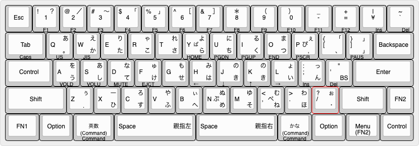
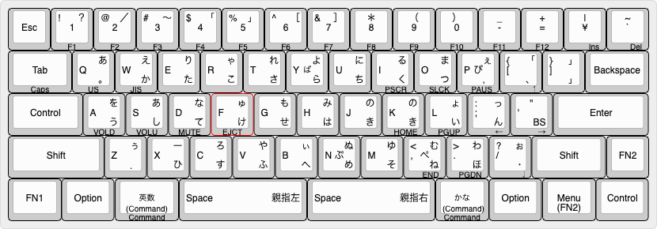

# NICOLA(A型配列) キーボート

日本語入力はMac向けの設定です。Windows向けの設定については、今後、開発する予定です。<br>
キーボード側でローマ字出力することによって、親指シフトキーボードを実現します。<br>
物理的なキー配列はUS配列ですが、US/JISのどちらのキーコードも切り替えて出力することができます。
## 配列
HHKBのUS配列に似た配列になっています。

**FN1キーを押した時の配列**


**FN2キーを押した時の配列**


- バックライトについて  
  かなキーを押すと、NICOLA入力モードになって、バックライトが点灯します。<br>英数キーを押すと、通常モードになって、バックライトが消灯します。
  ```
  XD64はBACKLIGHTとRGBLIGHTの2種類のLEDを制御できます。BACKLIGHTはキーキャップの裏にあるLEDでご自身で取り付ける必要があります。RGBLIGHTはPCBボードの裏にあってあらかじめ取り付けられています。BACKLIGHTはNICOLA入力モードを表現し、RGBLIGHTは将来の拡張のため使っていません。Mac/Windows/Linuxなどの入力モードを表現するようにしたいと思っています。
  ```
- FN1キー  
  FN1キーを押しながら、HJKLキーを押すことでカーソルを動かすことができます。viに慣れた人向け。左手小指の付け根あたりでFN1キーを押して、右手でHJKLキーを押すと便利です。
- FN2キー  
  HHKBのようにカーソルを動かすことができます。HHKBに慣れた人向け。
- FNキー+Qキー  
  US配列モードに切り替えます。USキー配列のキーコードをパソコンに出力します。パソコンはUS配列の設定にしてください。デェフォルトはUS配列です。
- FNキー+Wキー  
  JIS配列モードに切り替えます。物理的にはUS配列ですが、パソコンにはJIS配列のキーコードを出力します。パソコンはJIS配列の設定にしてください。
- 英数キー  
  英数キーを押しながら他のキーを押すと、Commandキーを押しながらそのキーを押したことになります。英数キー単体を押して離すと、英数キーを押したことになり、半角英数モードになります。SHIFTキーを押しながら英数キーを押す、または、かなキーを押しながら英数キーを押すと、全角英数モードになります。
- かなキー  
  かなキーを押しながら他のキーを押すと、Commandキーを押しながらそのキーを押したことになります。かなキー単体を押して離すと、かなキーを押したことになり、ひらがなモードになります。SHIFTキーを押しながらかなキーを押す、または、英数キーを押しながらかなキーを押すと、全角カタカナモードになります。
- 親指右キー  
  NICOLAモードのときは、親指右キーとして動作します。通常入力モードではスペースキーとして動作します。親指右キーを単体で押して離した場合もスペースキー(変換キー)として動作します。
- NICOLAモードのときは、親指左キーとして動作します。通常入力モードではスペースキーとして動作します。親指右キーを単体で押して離した場合は、全角カタカナ→半角カタカナ→全角英数→ひらがな→(全角カタカナに戻る)へ文字種を変換します。
- BSキー (Enterキーの隣のキー)  
  NICOLAのA型配列にはEnterキーの隣のBSキーは定義されていません。しかし、BSキーがあると便利なので、NICOLAモードのときに'(QUOT)キーを押すと、バックスペースの動作になるようにしました。通常、NICOLAモードではキーリピートしませんが、BSキーだけはリピートするようにしています。
- Menuキー  
  MacにはMenuキーがないですが、将来はWindowsでも使えるように改造しようと思っているためMenuキーを用意しました。Menuキーを単体で押して離すとMenuキーとして動作し、Menuキーを押しながら他のキーを押すとFN2キーとして動作するようにしています。
 ## 開発者向け情報
   カストマイズしやすくするため、keymap.cの最初の方にカストマイズ用の関数を用意しました。ご自身の環境に合わせて変更することで、快適な入力環境になると思います。

- send_eisu関数  
  英数キーを押した時に呼び出される関数です。現在は、CTRL+SHIFT+'(QUOT)を出力して、半角英数モードにします。
- send_shift_eisu関数
  SHIFTキー＋英数キー、または、かなキー＋英数キーを押した時に呼び出される関数です。現在は、CTRL+SHIFT+Lを出力して、全角英数モードにします。
- send_kana関数  
  かなキーを押した時に呼び出される関数です。現在は、CTRL+SHIFT+Jを出力して、かなモードにします。
- send_shift_kana関数  
  SHIFTキー＋かなキー、または、英数キー＋かなキーを押した時に呼び出される関数です。現在は、CTRL+SHIFT+Kを出力して、全角カタカナモードにします。
- send_right_spacebar関数  
  NICOLAモードのときに親指右キーを押した時に呼び出される関数です。現在はスペースキーを出力して、変換動作をします。
- send_left_spacebar関数  
  NICOLAモードのときに親指左キーを押した時に呼び出される関数です。現在は、押されるたびに、CTRL+K, CTRL+;, CTRL+L, CTRL+Jを次々に出力して、全角カタカナ、半角カタカナ、全角英数、かなに文字種を変更します。
- send_zen_eisu関数とsend_zen_kana関数  
  NICOLAモードのときに、”／"(親指キー＋2）を入力するためには、一時的に英数モードに切り替えて、SHIFT+/のキーコードを出力して、再び、かなモードに戻す必要があります。そのため、英数モードに切り替えるときに、send_zen_eisu関数が呼ばれ、かなモードに戻すときにsend_zen_kana関数が呼ばれます。